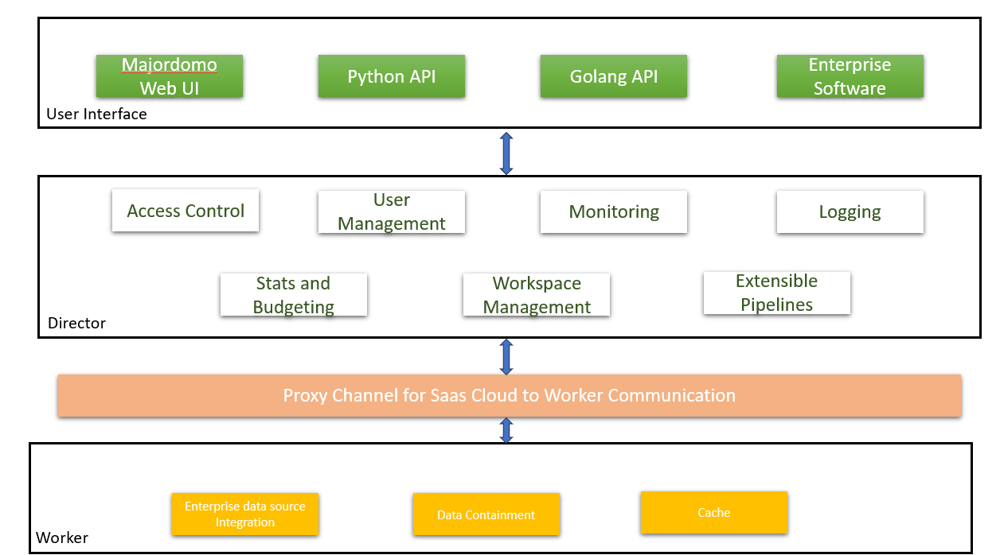
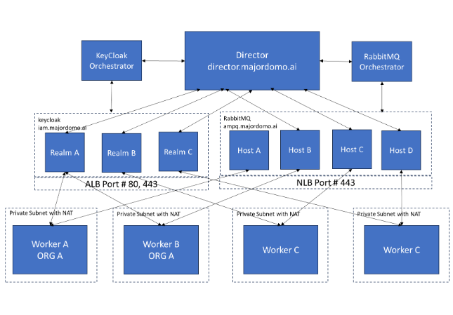

# Component Architecture

The Majordomo AI solution is a SaaS solution that has a cloud component called Director which maintains the information about the enterprise accounts and the AI pipelines within that. There is a separate component called the worker which runs within the customer network or VPC and performs the data related work. This ensures that the customer data never crosses their managed network boundary. 

Key aspects of the architecture

- All worker to director communication happens via a proxy channel that is secured and authenticated. Every worker is served with a unique id and secret key which is used to validate the worker while joining the channel. 

- All user management and validation happens at the director. IDP integrations with key providers such as Google and Facebook will be provided. 

- There can be a plethora of enterprise data software that will eventually be supported as data source for the RAG pipelines. As long as the data stores remain within the customer network or VPC, no customer data needs to cross the customer network boundary.

- API availability can be provided in any language of customer choice. Currrently we support Python API and Golang API.

# Communication Architecture

## Features

- The SaaS solution at the director end is fully scalable and provides isolation for customer information both at the Keycloak IDP level as well as with the proxy infrastructure.

- The director components are horizontally scalable and can cater to increased work load through K8s auto-scaling. 

- The communication between the director and the worker happens via a proxy channel that is fully authenticated and secure. When the worker is brought up in the customer network, an associated component called the worker proxy is also brought up. This takes care of all the interfacing between the worker and the director.
