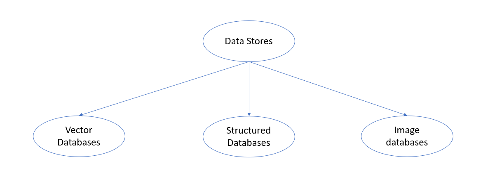

# Data Stores

## Introduction

Data Stores in Majordomo AI are essentially of 3 categories. 

## Vector databases

This type of database is used to store vector embeddings and is typically used in the RAG pipeline. Any text based input source such as documents, webpages, Slack, Confluence, Gmail etc. can be ingested into vector database and can be used for matching queries and returning relevant context information for the LLMs to process and response. 

## Structured databases

These are the traditional databases that are typically used in enterprises for storing structured data, eg in SQL or NoSQL formats. The LLM models and the RAG tools are adding more and more capabilities to query the structured databases as well in addition to vector databases for returning natural language responses which will be suitable for applications that want to output a more descriptive response for its audience. The typical operational pipeline for the TAG (table augumented generation) involves retrieving the schema for a particular database and then using that in the prompt context to construct a query for the the database using the LLM for the natural language question from the user.

The structured databases can either be specifically constructed for TAG query operations in which case Majordomo AI will support pipelines to ingest data into them. Or they can be pre-built databases that are managed by other customer software that are also being reused for the TAG queries. 

In the case of an database software provided direct AI capability that can be leveraged by the user, it can be done using direct APIs of the vendor. However those responses can then be combined with other query pipelines that Majordomo AI manages to provider a better qualified answer to the queries. 

## Image databases

These are a combination of a vector database and a structured database such as Postgres SQL used to separately store the image embedding and image data information. The vector database is typically a low dimension one built using one of the multimodal embedding models that can support matching text-to-image and image-to-image queries and providing a matching image reference. The original image is then stored in the structured database and can be retrieved from there and provided back to the user. Incase the user has their own image database and only the IDs are required for image searches, then the vector database can be used directly.  Majordomo AI will also support extraction and ingestion of images from documents into an image database through its ingestion pipelines. 
